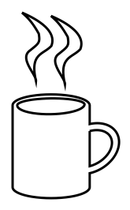
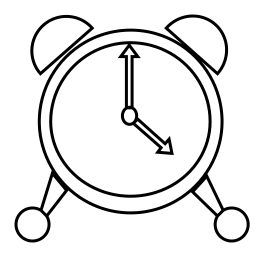

# Custom Shapes

Paint.NET's Shapes tool supports Custom Shapes as a form of declarative plugin - code is not involved! The object model is intentionally identical to [WPF geometry](xref:System.Windows.Media.Geometry), with only a few caveats, and is compatible with XAML files created for WPF as long as you change the namespace and wrap the geometry object in a `SimpleGeometryShape` element.

The object model for Custom Shapes is contained in the [PaintDotNet.Shapes](xref:PaintDotNet.Shapes) and [PaintDotNet.UI.Media](xref:PaintDotNet.UI.Media) namespaces.

Links:
- [Installing Additional Plugins](https://getpaint.net/doc/latest/InstallPlugins.html) - Paint.NET Documentation
- [Plugins - Shapes section of the Paint.NET forum](https://forums.getpaint.net/forum/48-shapes/). Download custom shapes plugins.
- [How to make custom shapes](https://forums.getpaint.net/topic/32101-how-to-make-custom-shapes-for-paintnet-406/) tutorial by BoltBait
- [ShapeMaker plugin by The Dwarf Horde](https://forums.getpaint.net/topic/110677-shapemaker-by-the-dwarf-horde-v1704-may-21-2022/)

## Differences from WPF Geometry
While the Custom Shapes object model is essentially identical to WPF's Geometry object model, there are a few differences:

Added:
- [PolyCurveSegment](xref:PaintDotNet.UI.Media.PolyCurveSegment)
  - This is a [PathSegment](xref:PaintDotNet.UI.Media.PathSegment) that draws a curve going through each given point. Also known as a [spline](https://en.wikipedia.org/wiki/Spline_(mathematics)).
  - These can be used within a [PathGeometry](xref:PaintDotNet.UI.Media.PathGeometry), similar to [PolyLineSegment](xref:PaintDotNet.UI.Media.PolyLineSegment) or [PolyBezierSegment](xref:PaintDotNet.UI.Media.PolyBezierSegment).
- [FlattenedGeometry](xref:PaintDotNet.UI.Media.FlattenedGeometry)
  - This is a declarative equivalent to the imperative [Geometry.GetFlattenedPathGeometry](https://learn.microsoft.com/en-us/dotnet/api/system.windows.media.geometry.getflattenedpathgeometry) (WPF) or [IGeometry.Simplify](xref:PaintDotNet.Direct2D1.IGeometry.Simplify*) (Direct2D) methods.
  - It is primarily useful for increasing the tesellation resolution of curves that, for whatever reason, appear "too pointy". This happens when Direct2D does not use enough line segments to approximate a curve.
  - You could also use this to reduce tessellation resolution, forcing a curve to appear "low-res" or "pointy." (use a value larger than 1 for the [FlatteningTolerance](xref:PaintDotNet.UI.Media.FlattenedGeometry.FlatteningTolerance) property).
  - This is used by the built-in Ellipse shape to improve its rendering quality (a very low flattening tolerance of 0.0001 is used).
- [OutlinedGeometry](xref:PaintDotNet.UI.Media.OutlinedGeometry)
  - This is a declarative equivalent to the imperative [Geometry.GetOutlinedPathGeometry](https://learn.microsoft.com/en-us/dotnet/api/system.windows.media.geometry.getoutlinedpathgeometry) (WPF) or [IGeometry.Outline](xref:PaintDotNet.Direct2D1.IGeometry.Outline*) (Direct2D) methods.
- [WidenedGeometry](xref:PaintDotNet.UI.Media.WidenedGeometry)
  - This is a declarative equivalent to the imperative [Geometry.GetWidenedPathGeometry](https://learn.microsoft.com/en-us/dotnet/api/system.windows.media.geometry.getwidenedpathgeometry) (WPF) or [IGeometry.Widen](xref:PaintDotNet.Direct2D1.IGeometry.Widen*) (Direct2D) methods.
  - Widening is often referred to as "stroking." You can use this to create the 2-dimensional stroked outline of a 1-dimensional line or curve.
  
Removed:
- [StreamGeometry](https://learn.microsoft.com/en-us/dotnet/api/system.windows.media.streamgeometry) does not exist
  - `StreamGeometry` is primarily used in code, not in XAML, and does not exist for Custom Shapes.
  - You can, however, use [Path Markup syntax](https://learn.microsoft.com/en-us/dotnet/desktop/wpf/graphics-multimedia/path-markup-syntax) to initialize any property of type [Geometry](xref:PaintDotNet.UI.Media.Geometry).
  - For example: `<SimpleGeometryShape Geometry="F1 M 21,142 L 160,22 L 300,142 L 300,318 L 21,318 Z" />`

## Examples
There are two primary ways of expression a custom shape. The first is with [Path Markup syntax](https://learn.microsoft.com/en-us/dotnet/desktop/wpf/graphics-multimedia/path-markup-syntax), and the other is with the Geometry object model.

### Path Markup syntax example
This is an example of a coffee mug shape defined using [Path Markup syntax](https://learn.microsoft.com/en-us/dotnet/desktop/wpf/graphics-multimedia/path-markup-syntax). This is part of [TechnoRobbo's shapes pack](https://forums.getpaint.net/topic/32140-trs-not-too-useful-but-fun-shapes/).

```xml
<ps:SimpleGeometryShape xmlns="clr-namespace:PaintDotNet.UI.Media;assembly=PaintDotNet.Framework"
                        xmlns:ps="clr-namespace:PaintDotNet.Shapes;assembly=PaintDotNet.Framework"                 
                        DisplayName="Mug"
                        Geometry="M 68,106 A 6.74,23.82,90,1,1,150.5,106 L 150.5,126 A 20.51,15.15,149.74,1,1,150.5,178.5 L 150.5,193.5 A 6.73,23.81,-90,1,1,68,193.5 L 68,106 M 73,106 A 4.03,20.96,89.29,1,1,145,105 A 6.8,24.52,-91.12,1,1,73,106 M 150.5,133.5 A 22.12,15.15,150.46,1,1,150.5,171 L 150.5,133.5 M 109,10.5 C 114.86,15.45,120,20.5,127,33,128.5,42.5,127.5,43,117.5,51,105.5,59.5,124.66,76.88,124,83.5,117,53.5,132,55.5,140.5,46,147.5,28,119.5,15,109,10.5 M 78,7 C 83.86,11.95,89,17,96,29.5,97.5,39,96.5,39.5,86.5,47.5,74.5,56,93.66,73.38,93,80,86,50,101,52,109.5,42.5,116.5,24.5,88.5,11.5,78,7
"/>
```



### Geometry object model example
This is an example of a clock shape defined using the Geometry object model. This is part of [TechnoRobbo's shapes pack](https://forums.getpaint.net/topic/32140-trs-not-too-useful-but-fun-shapes/).

```xml
<ps:SimpleGeometryShape xmlns="clr-namespace:PaintDotNet.UI.Media;assembly=PaintDotNet.Framework"
		xmlns:ps="clr-namespace:PaintDotNet.Shapes;assembly=PaintDotNet.Framework"
		DisplayName="Clock">
	<GeometryGroup FillRule="EvenOdd">
		<PathGeometry>
				<PathFigure IsClosed="False" IsFilled="True" StartPoint="87,254">
					<ArcSegment Size="160,160" RotationAngle="0" IsLargeArc="True" SweepDirection="CounterClockwise" Point="408,254" />
				</PathFigure>
				<PathFigure IsClosed="False" IsFilled="True" StartPoint="87,254">
					<ArcSegment Size="160,160" RotationAngle="0" IsLargeArc="True" SweepDirection="Clockwise" Point="408,254" />
				</PathFigure>
				<PathFigure IsClosed="False" IsFilled="True" StartPoint="107,254">
					<ArcSegment Size="88,89" RotationAngle="87" IsLargeArc="True" SweepDirection="Clockwise" Point="387,254" />
					<ArcSegment Size="75,80" RotationAngle="-89" IsLargeArc="True" SweepDirection="Clockwise" Point="107,254" />
				</PathFigure>
				<PathFigure IsClosed="True" IsFilled="True" StartPoint="310,90">
					<ArcSegment Size="34,33" RotationAngle="130" IsLargeArc="True" SweepDirection="Clockwise" Point="400,170" />
					<LineSegment Point="310,90" />
				</PathFigure>
				<PathFigure IsClosed="True" IsFilled="True" StartPoint="180,90">
					<ArcSegment Size="34,34" RotationAngle="48" IsLargeArc="True" SweepDirection="CounterClockwise" Point="89,170" />
					<LineSegment Point="180,90" />
				</PathFigure>
				<PathFigure IsClosed="False" IsFilled="True" StartPoint="90,410">
					<ArcSegment Size="29,29" RotationAngle="147" IsLargeArc="True" SweepDirection="CounterClockwise" Point="100,420" />
				</PathFigure>
				<PathFigure IsClosed="False" IsFilled="True" StartPoint="410,410">
					<ArcSegment Size="29,29" RotationAngle="29" IsLargeArc="True" SweepDirection="Clockwise" Point="400,420" />
				</PathFigure>
				<PathFigure IsClosed="True" IsFilled="True" StartPoint="240,230">
					<LineSegment Point="240,140" />
					<LineSegment Point="230,140" />
					<LineSegment Point="245,120" />
					<LineSegment Point="260,140" />
					<LineSegment Point="250,140" />
					<LineSegment Point="250,230" />
					<LineSegment Point="240,230" />
				</PathFigure>
				<PathFigure IsClosed="False" IsFilled="True" StartPoint="233,244">
					<ArcSegment Size="10,12" RotationAngle="0" IsLargeArc="True" SweepDirection="CounterClockwise" Point="258,244" />
				</PathFigure>
				<PathFigure IsClosed="False" IsFilled="True" StartPoint="233,244">
					<ArcSegment Size="10,12" RotationAngle="0" IsLargeArc="True" SweepDirection="Clockwise" Point="258,244" />
				</PathFigure>
				<PathFigure IsClosed="True" IsFilled="True" StartPoint="260,250">
					<LineSegment Point="308,293" />
					<LineSegment Point="315,285" />
					<LineSegment Point="320,310" />
					<LineSegment Point="295,308" />
					<LineSegment Point="301,300" />
					<LineSegment Point="252,257" />
					<LineSegment Point="260,250" />
				</PathFigure>
				<PathFigure IsClosed="True" IsFilled="True" StartPoint="110,345">
					<LineSegment Point="135,375" />
					<LineSegment Point="100,420" />
					<LineSegment Point="90,410" />
					<LineSegment Point="110,345" />
				</PathFigure>
				<PathFigure IsClosed="True" IsFilled="True" StartPoint="356.25,377.5">
					<LineSegment Point="381.25,350" />
					<LineSegment Point="410,410" />
					<LineSegment Point="400,420" />
					<LineSegment Point="356.25,377.5" />
				</PathFigure>
		</PathGeometry>
	</GeometryGroup>
</ps:SimpleGeometryShape>
```


